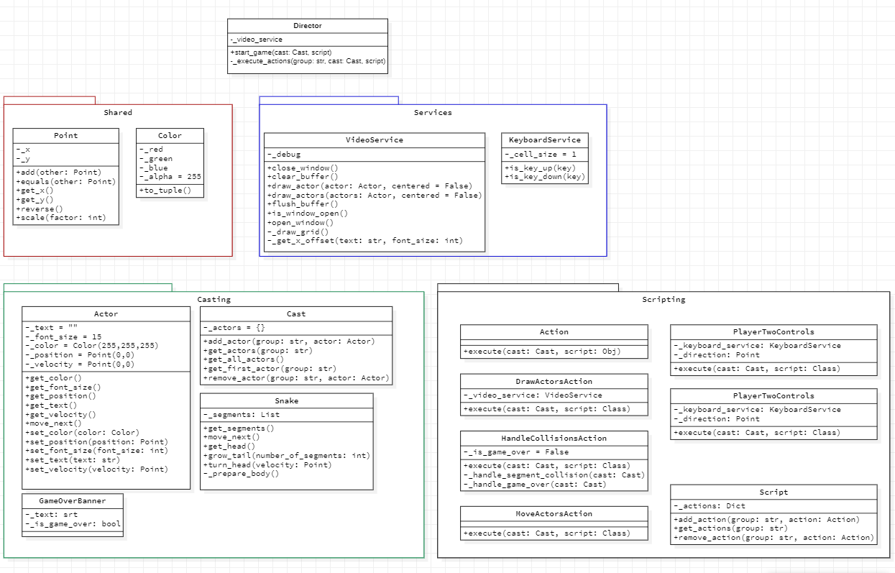

# Cycle Specification

> The best rides are the ones where you
> bite off much more than you can chew,
> and live through it.
> 
> &mdash; Doug Bradbury &mdash;


## Overview

---

Cycle is a game where the players try to cut each other off using cycles that leave a trail behind them.

## Rules

---

Cycle is played according to the following rules.

- Players can move up, down, left and right...
    - Player one moves using the W, S, A and D keys.
    - Player two moves using the I, K, J and L keys.
- Each player's trail grows as they move.
- Players try to maneuver so the opponent collides with their trail.
- If a player collides with their opponent's trail...
    - A "game over" message is displayed in the middle of the screen.
    - The cycles turn white.
    - Players keep moving and turning but don't run into each other.

## Interface

---


## Project Structure

---

The project files and folders are organized as follows:

```
root                    (project root folder)
+-- Cycle               (source code for game)
  +-- casting           (specific game classes)
  +-- directoring       (director class for game)
  +-- scripting         (utility game classes)
  +-- services          (services game classes)
  +-- shared            (game definition classes)
  +-- __main__.py       (entry point for program)
  +-- constants.py      (constants for the program)
+-- design.png          (UML Class design)
+-- README.md           (general info)
```

## Class Design Diagram

---

This show the classes with attributes and methods


## Requirements

---

Your program must also meet the following requirements.

- The program must include a README file.
- The program must include class and method comments.
- The program must have at least 16 classes.
- The program must remain true to game play described in the overview.

## Development Setup

---

In order to have a consistent experience in all platforms you must create a virtual environment
and download the corresponding libraries
- Create Virtual Environment: ```python3 -m venv venv --prompt Cycle```
- Activate Virtual Environment: 
    - ```.\venv\Scripts\activate``` (Windows )
    - ```source ./venv/bin/activate``` (MacOS / Linux )
- Install required libraries: ```pip install -r requirements.txt```

## Run the App

---

After you have finished the Development Environment Setup and with an activated
environment, you can run the app with the command ```python3 Cycle```

## Team Members

---

- Cate Schmidt  -> ch21103@byui.edu
- Danny Hernandez -> her17048@byui.edu
- Anthuan Morera Zaldivar -> mor21098@byui.edu
- Alan Montoya -> mon21033@byui.edu

## Have Some Fun

---

Have some fun by enhancing the game any way you like. A few ideas are as follows.

- Enhanced scoring and game reset.
- Enhanced game play and game over messages.
- Enhanced game display, e.g. cycle and trails